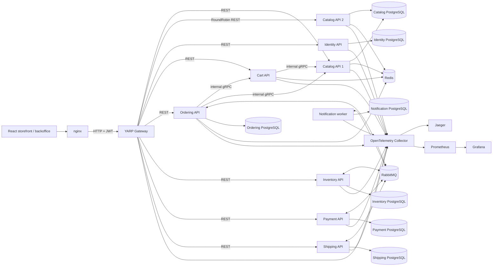
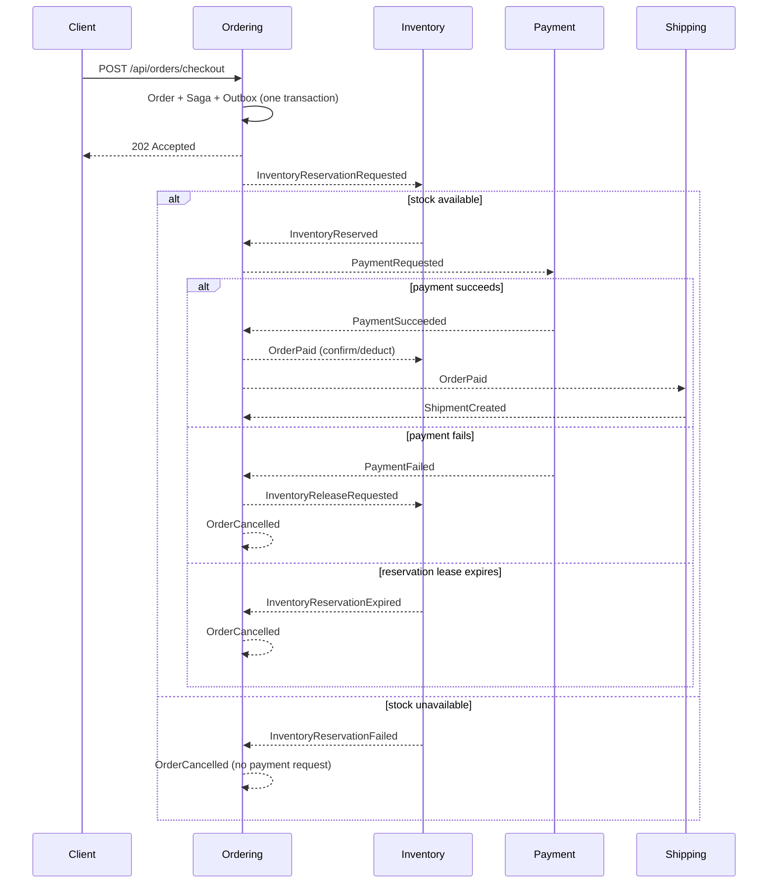

# Commerce microservices reference

Commerce is a runnable .NET 10 reference system with a React storefront and permission-aware administration portal. It demonstrates Clean Architecture, domain-driven design, CQRS, service-owned data, internal gRPC, RabbitMQ workflows, Outbox/Inbox reliability, Redis, YARP, JWT security, resilience, and OpenTelemetry. The distributed consistency boundaries are explicit and the normal local workflow runs entirely in Docker.

## Architecture



The Gateway is a thin REST edge. It has no generated service clients, service-contract references, or business orchestration. Synchronous questions use internal gRPC; business facts and workflow transitions use RabbitMQ.

## Bounded contexts

| Context | Responsibility | Durable state |
| --- | --- | --- |
| Identity | ASP.NET Core Identity, JWT, refresh rotation/revocation, roles | `commerce_identity` |
| Catalog | Products, SKU, price, description, activation, snapshots | `commerce_catalog` + Redis cache |
| Cart | Authenticated customer's expiring product snapshots | Redis |
| Inventory | On-hand/reserved stock, idempotent leased reservations, confirmation/release/expiry | `commerce_inventory` |
| Ordering | Order aggregate, item/address snapshots, checkout Saga | `commerce_ordering` + Redis idempotency leases |
| Payment | Idempotent payment records and deterministic fake provider | `commerce_payment` |
| Shipping | Shipment lifecycle and tracking | `commerce_shipping` |
| Notification | Durable event ingestion and fake email dispatch | `commerce_notification` |

Every domain-rich service follows Api → Application → Domain and Infrastructure → Application + Domain. Contracts contain primitive integration DTOs only. Architecture tests enforce domain isolation and keep the Gateway independent from service layers.

## Communication map

Internal gRPC is limited to bounded, idempotent reads:

- Cart → Catalog: `CatalogInternalGrpc.GetProduct`
- Ordering → Cart: `CartInternalGrpc.GetCartForCheckout`
- Ordering → Catalog: `CatalogInternalGrpc.GetProducts`

RabbitMQ uses durable topic exchange `commerce.events`, persistent messages, publisher confirms, manual acknowledgements, bounded retry queues, and dead-letter queues. The main event paths are:

```text
Ordering: InventoryReservationRequested
Inventory: InventoryReserved | InventoryReservationFailed | InventoryReleased | InventoryReservationExpired
Ordering: PaymentRequested | InventoryReleaseRequested | OrderPaid | OrderCancelled
Payment: PaymentSucceeded | PaymentFailed
Shipping: ShipmentCreated | ShipmentDelivered
Notification: consumes order, payment, and shipment events
```

Relational writers put state changes and `OutboxMessage` rows in one local transaction. Background processors claim rows with expiring leases, publish at least once, and mark confirmed messages. Consumers store a unique `(MessageId, Consumer)` Inbox record in the same transaction as their mutation. The project deliberately does not claim exactly-once delivery.

## Checkout Saga



Checkout is eventually consistent: the HTTP request returns after the Ordering transaction, not after Inventory, Payment, and Shipping finish.
Inventory scans expired pending leases in bounded batches. The stock mutation and `InventoryReservationExpired` Outbox row commit atomically; `InventoryExpiration:IntervalSeconds` and `BatchSize` control the worker.

## Start the complete stack

Prerequisites are Docker Desktop/Engine with Compose. No local PostgreSQL, Redis, RabbitMQ, or .NET runtime is required for the normal full-stack flow.

The frontend lives in the separate public [commerce-web repository](https://github.com/vixtruong/commerce-web). Clone it next to this backend checkout before starting Compose:

```bash
git clone https://github.com/vixtruong/commerce-web.git ../Commerce.Web
```

Compose builds from `../Commerce.Web` by default. Set `FRONTEND_SOURCE_PATH` to another frontend checkout if needed. The backend integration branch for the complete Storefront/backoffice APIs is `codex/full-stack-commerce` until merged.

```bash
cp .env.example .env
docker compose up --build
```

PowerShell:

```powershell
Copy-Item .env.example .env
docker compose up --build
```

Compose creates seven logical databases through `deploy/postgres/init-databases.sql`. Each Development service then applies its own checked-in EF Core migrations before accepting traffic. Catalog instance 2 waits for instance 1 so the shared Catalog database is not seeded concurrently. This automatic migration policy is local-development convenience; production deployments should apply the same migrations in a controlled release step.

### Development seed

For the 200-product technology/accessory customer demonstration, see [demo setup and collections](docs/demo-data-guide.md). The importer adds vendor-sourced models/photos, Catalog groups, synthetic customers/staff and real local checkout workflows through YARP, preserving existing data and using resumable checkpoints.

Seed values are stable and are enabled only in the Docker Development environment:

| Data | Value |
| --- | --- |
| Customer | `customer@commerce.local` / `Customer123!` |
| Administrator | `admin@commerce.local` / `Administrator123!` |
| MacBook Pro | id `11111111-1111-1111-1111-111111111111`, SKU `MACBOOK-PRO-001`, 1999 USD, stock 10 |
| Mechanical Keyboard | id `22222222-2222-2222-2222-222222222222`, SKU `KEYBOARD-001`, 120 USD, stock 50 |

These are deliberately local credentials. Change all `.env` values outside an isolated development machine; `.env` is ignored by Git.

### Ports

| Component | URL or address |
| --- | --- |
| Gateway | <http://localhost:8080> |
| Storefront and administration | <http://localhost:8088> |
| PostgreSQL | `127.0.0.1:${POSTGRES_PORT:-5432}` |
| Redis | `127.0.0.1:${REDIS_PORT:-6379}` |
| RabbitMQ Management | <http://localhost:15672> |
| Jaeger | <http://localhost:16686> |
| Prometheus | <http://localhost:9090> |
| Grafana | <http://localhost:3000> |

PostgreSQL and Redis are bound to the local loopback interface for database management tools. Application service ports, RabbitMQ AMQP, and OTLP remain on the private `commerce-network`. OpenAPI documents are available when an individual API is run or temporarily exposed in Development.

For the complete component, protocol, data ownership, Saga, and observability map, see [`docs/architecture.md`](docs/architecture.md). For PostgreSQL GUI connection settings and step-by-step Grafana, Prometheus, Jaeger, RabbitMQ, Redis, health, and log workflows, see [`docs/local-infrastructure-guide.md`](docs/local-infrastructure-guide.md).

## Reproducible checkout demo

The automated PowerShell smoke test waits for readiness, logs in, reads Catalog through YARP, writes Cart through Redis, starts checkout, polls the order, and verifies Payment, Shipping, and Inventory:

```powershell
./scripts/smoke-test.ps1
```

On Linux/macOS, install `curl` and `jq`, then run:

```bash
./scripts/smoke-test.sh
```

Equivalent REST calls all go through the Gateway:

```bash
TOKEN=$(curl -s http://localhost:8080/api/auth/login \
  -H 'Content-Type: application/json' \
  -d '{"email":"customer@commerce.local","password":"Customer123!"}' | jq -r .accessToken)

curl http://localhost:8080/api/catalog/products

curl -X PUT http://localhost:8080/api/cart/items/11111111-1111-1111-1111-111111111111 \
  -H "Authorization: Bearer $TOKEN" -H 'Content-Type: application/json' -d '{"quantity":1}'

curl -X POST http://localhost:8080/api/orders/checkout \
  -H "Authorization: Bearer $TOKEN" -H 'Idempotency-Key: demo-checkout-v1' \
  -H 'Content-Type: application/json' \
  -d '{"recipientName":"Commerce Customer","addressLine1":"1 Architecture Way","city":"Hanoi","postalCode":"100000","countryCode":"VN"}'

curl http://localhost:8080/api/orders/ORDER_ID -H "Authorization: Bearer $TOKEN"
```

To demonstrate payment compensation while preserving local data, recreate only Payment with the failure outcome:

```powershell
$env:PAYMENT_OUTCOME = 'Failure'
docker compose up -d --no-deps --wait --wait-timeout 90 payment-api
./scripts/smoke-test-payment-failure.ps1
$env:PAYMENT_OUTCOME = 'Success'
docker compose up -d --no-deps --wait --wait-timeout 90 payment-api
Remove-Item Env:PAYMENT_OUTCOME
```

The script verifies `Payment=Failed`, `Order=Cancelled`, the reservation is released, and physical stock is unchanged.

## Redis, load balancing, and failure behavior

Redis keys are intentionally separated by purpose:

- `catalog:product:v1:{productId}` — five-minute cache-aside DTO
- `cart:v1:{customerId}` — seven-day primary Cart record
- `idempotency:v1:{scope}:{key}` — checkout processing/completion lease
- distributed locks use atomic `SET NX PX` and token-checked Lua release; Inventory correctness does not rely on Redis

YARP routes Catalog with `RoundRobin` across `catalog-api-1` and `catalog-api-2`. Catalog returns `X-Service-Instance`, so repeated product requests show real container rotation:

```bash
curl -i http://localhost:8080/api/catalog/products
curl -i http://localhost:8080/api/catalog/products
docker compose stop catalog-api-1
curl -i http://localhost:8080/api/catalog/products
docker compose start catalog-api-1
```

YARP actively probes `/health/ready`; traffic continues through the healthy destination and the recovered instance rejoins later.

## Health and observability

Every process exposes `/health/live` and `/health/ready`. Readiness checks service-relevant PostgreSQL, Redis, and RabbitMQ dependencies. Compose uses `pg_isready`, `redis-cli ping`, `rabbitmq-diagnostics`, and API readiness rather than startup sleeps.

Structured Serilog output is visible with:

```bash
docker compose logs -f ordering-api inventory-api payment-api
```

HTTP, runtime, outgoing service calls, and RabbitMQ producer/consumer spans export over OTLP. W3C trace context is copied into RabbitMQ headers, so Jaeger can connect the Gateway/Ordering request to asynchronous Inventory, Payment, Shipping, and Notification work. The collector exposes application metrics and its own internal pipeline metrics to Prometheus. Grafana is provisioned with a comprehensive **Commerce System Overview** dashboard for Gateway, services, .NET runtime, OpenTelemetry Collector, and RabbitMQ queue-level monitoring.

## Local CLI development and migrations

For a local API process, use `localhost` connection strings/service URLs through user secrets or environment variables. Docker overrides the same keys with service DNS names such as `postgres`, `redis`, `rabbitmq`, `catalog-api-1`, and `cart-api`. No infrastructure address is hard-coded in C#.

Restore, build, and test:

```bash
dotnet restore Commerce.slnx
dotnet build Commerce.slnx --no-restore
dotnet test Commerce.slnx --no-build --no-restore -m:1
```

The single MSBuild node keeps solution-wide test execution predictable on Windows hosts with many projects; individual test projects can still be run in parallel when desired.

Create a new service-owned migration by selecting its Infrastructure project and API startup project, for example:

```bash
dotnet ef migrations add AddCatalogFeature \
  --project src/Services/Catalog/Catalog.Infrastructure \
  --startup-project src/Services/Catalog/Catalog.Api \
  --context CatalogDbContext \
  --output-dir Persistence/Migrations
```

## Reset and troubleshooting

Reset every persisted local dependency and recreate databases/seeds:

```bash
docker compose down -v
docker compose up --build
```

Useful diagnostics:

```bash
docker compose config
docker compose ps
docker compose logs --tail=100 catalog-api-1 ordering-api rabbitmq
curl -i http://localhost:8080/health/ready
curl -i http://localhost:8080/api/catalog/products
```

- A service stuck `unhealthy` usually reports its unavailable dependency in `/health/ready`; inspect its logs.
- RabbitMQ queues, retry queues, dead-letter queues, bindings, consumers, and rates are visible in the Management UI using the `.env` credentials.
- If login seed data is absent, verify the Identity container uses `ASPNETCORE_ENVIRONMENT=Development` and `DevelopmentSeed__Enabled=true`.
- If an old schema conflicts with current migrations, use `docker compose down -v`; this intentionally deletes local development data.

## Architectural decisions

Concise rationale for the major choices lives under [`docs/adr`](docs/adr): YARP at the edge, internal-only gRPC, RabbitMQ integration events, database-per-service, Outbox/Inbox, Ordering Saga orchestration, Redis responsibilities, and PostgreSQL.

## React storefront and administration

Open [the storefront](http://localhost:8088) after Compose is healthy. Sign in with the development accounts above. The administrator can open `/admin`; customers receive a 403 page there. React uses real YARP APIs for catalog, live availability, cart, asynchronous checkout, order history and account data. The backoffice includes operational summaries, product editing/publication, audited stock adjustments, reservation history, orders, payments, shipments, users, editable staff permission bundles, access audit and Gateway readiness.

The frontend uses React 19, strict TypeScript, Vite, React Router, TanStack Query/Table, React Hook Form, Zod, Zustand for UI state, Tailwind CSS, Radix Dialog, Lucide and Recharts. See [frontend architecture and routes](docs/frontend-architecture.md), [authorization rules and endpoint matrix](docs/authorization.md), and [API audit](docs/frontend-api-audit.md).

Frontend code, package tooling, Storybook and quality CI belong to [commerce-web](https://github.com/vixtruong/commerce-web). This repository owns backend contracts and the full-stack Compose/browser integration workflow. Neither repository vendors the other's source.

For frontend development, keep Compose running and start Vite:

```bash
cd ../Commerce.Web
pnpm install --frozen-lockfile
pnpm dev
```

Vite serves `http://localhost:5173` and proxies `/api` to YARP at port 8080. Node 22 and pnpm 10.17.1 are configured. `VITE_API_BASE_URL` is optional: leave it empty for the same-origin Vite/nginx proxy, or set it to the Gateway URL in a local frontend `.env`. Compose uses nginx on port 8088 and requires no runtime frontend credentials. Never put secrets in `VITE_*` variables because they are bundled for the browser. Playwright accepts `WEB_BASE_URL`, `API_BASE_URL` (the Gateway), and reads development credentials from the root `.env`.

```bash
pnpm lint
pnpm typecheck
pnpm test
pnpm build
pnpm build-storybook
pnpm exec playwright install chromium
pnpm test:e2e
```

`pnpm storybook` opens component examples at port 6006. Playwright writes responsive screenshots to the frontend's `artifacts/frontend-visual` and browser diagnostics under `playwright-report` / `test-results`. Set `E2E_ENV_FILE=../Commerce/.env`, supply environment variables, or configure the frontend's ignored `.env.e2e` using `.env.e2e.example`. The frontend workflow checks lint/types/tests/build/Storybook; this backend workflow checks .NET and checks out `commerce-web` for Compose browser flows. Browser fixtures use isolated customer accounts; administrative test products are deactivated afterward and retained for audit.

Authorization uses role bundles resolved by Identity, permission policies on each service and owner checks on customer resources. Existing `Admin`/`Customer` roles remain; CatalogManager, WarehouseManager, OrderManager and SupportAgent presets are added. Access JWTs expire after 15 minutes (with 30 seconds of validation clock tolerance); refresh reloads current permissions and rotates with one concurrent winner. User membership edits revoke refresh sessions. Already-issued access claims remain valid until expiry. There are no direct user permission overrides.

Checkout saves a stable owner-scoped key and address before submission, reuses it after a network failure/remount and resumes the accepted order. The processing page polls only while needed, waits for shipment creation and finishes compensation before saying stock was released. Payment is the existing fake development provider; no real card charge is performed. Product photos, ordered galleries, multipart uploads and collection assignment are supported; legacy seed illustrations remain labeled samples. Unsupported refunds, administrative order cancellation, password changes, profile editing and carrier integration have no misleading controls. See [the demo data guide](docs/demo-data-guide.md) for the 200 technology models, accounts, orders and local setup.

Three new service-owned migrations add the Ordering shipment snapshot, Inventory adjustment audit and Identity access audit. Development Compose applies them automatically; production must apply them in a controlled release step. gRPC and integration event contracts, routing keys, queues and Saga ownership remain unchanged. The Gateway still contains no domain logic.

To verify failure without deleting local data, recreate only Payment:

```powershell
$env:PAYMENT_OUTCOME = 'Failure'
docker compose up -d --no-deps --wait --wait-timeout 90 payment-api
./scripts/smoke-test-payment-failure.ps1
$env:E2E_ENV_FILE = '../Commerce/.env'
pnpm --dir ../Commerce.Web test:e2e --grep 'customer checkout'
$env:PAYMENT_OUTCOME = 'Success'
docker compose up -d --no-deps --wait --wait-timeout 90 payment-api
Remove-Item Env:PAYMENT_OUTCOME
Remove-Item Env:E2E_ENV_FILE
```

The [Postman collection](docs/postman/commerce-microservices-api.postman_collection.json) is importable and contains Gateway-only requests with blank credentials. Remote Postman synchronization requires an available Postman MCP connector. See the [implementation and validation report](docs/implementation-validation.md) for the delivered scope, commands, verified results and deliberate boundaries.
