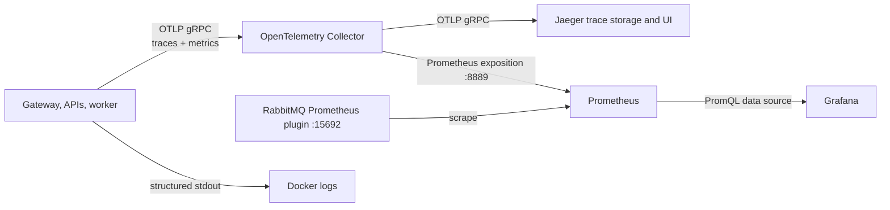

# Commerce architecture

This document describes the runtime architecture of the Docker-based Commerce system. The source code and `docker-compose.yml` remain the source of truth when the implementation changes.

## Detailed runtime diagram

```mermaid
flowchart TB
    classDef edge fill:#e8f1ff,stroke:#3973ac,color:#152238
    classDef service fill:#eef8ee,stroke:#4d8b4d,color:#152238
    classDef broker fill:#fff4d6,stroke:#b58105,color:#152238
    classDef data fill:#f4eafa,stroke:#7e57a0,color:#152238
    classDef observe fill:#fdecec,stroke:#b85656,color:#152238
    classDef external fill:#f4f4f4,stroke:#707070,color:#152238

    subgraph External[Developer and client boundary]
        Client[Browser / mobile / REST client]
        Postman[Postman collection]
        DbTool[DBeaver / pgAdmin / DataGrip]
        Operator[Developer / operator]
    end

    subgraph Edge[Public HTTP edge]
        Gateway[Commerce.Gateway<br/>YARP reverse proxy<br/>JWT validation, CORS, rate limiting<br/>host port 8080]
    end

    subgraph Services[Application processes on commerce-network]
        Identity[Identity.Api<br/>registration, login, refresh tokens, roles]
        Catalog1[Catalog.Api instance 1<br/>products and prices]
        Catalog2[Catalog.Api instance 2<br/>products and prices]
        Cart[Cart.Api<br/>customer cart and product snapshots]
        Ordering[Ordering.Api<br/>order aggregate, idempotency, Saga]
        Inventory[Inventory.Api<br/>on-hand stock and leased reservations]
        Payment[Payment.Api<br/>idempotent fake payment provider]
        Shipping[Shipping.Api<br/>shipment lifecycle and tracking]
        Notification[Notification.Worker<br/>durable fake notification delivery]
    end

    subgraph Messaging[Asynchronous messaging]
        Rabbit[(RabbitMQ<br/>topic exchange: commerce.events<br/>retry and dead-letter queues)]
        Outbox[Transactional Outbox<br/>publisher confirms and leases]
        Inbox[Transactional Inbox<br/>MessageId + Consumer deduplication]
    end

    subgraph State[Service-owned state]
        Postgres[(PostgreSQL 17<br/>host loopback port 5432 by default)]
        IdentityDb[(commerce_identity)]
        CatalogDb[(commerce_catalog)]
        InventoryDb[(commerce_inventory)]
        OrderingDb[(commerce_ordering)]
        PaymentDb[(commerce_payment)]
        ShippingDb[(commerce_shipping)]
        NotificationDb[(commerce_notification)]
        Redis[(Redis 8<br/>Catalog cache<br/>Cart primary store<br/>Checkout idempotency and locks)]
    end

    subgraph Observability[Observability pipeline]
        OTel[OpenTelemetry Collector<br/>OTLP gRPC 4317 inside Docker]
        Jaeger[Jaeger<br/>distributed traces<br/>host port 16686]
        Prometheus[Prometheus<br/>metrics and PromQL<br/>host port 9090]
        Grafana[Grafana<br/>dashboards<br/>host port 3000]
        Logs[Docker logs<br/>structured Serilog events]
    end

    Client -->|HTTPS/HTTP + JWT| Gateway
    Postman -->|REST via baseUrl| Gateway
    Gateway -->|/api/auth| Identity
    Gateway -->|/api/catalog<br/>round-robin + health probes| Catalog1
    Gateway -->|/api/catalog<br/>round-robin + health probes| Catalog2
    Gateway -->|/api/cart| Cart
    Gateway -->|/api/orders| Ordering
    Gateway -->|/api/inventory| Inventory
    Gateway -->|/api/payments| Payment
    Gateway -->|/api/shipping| Shipping

    Cart -->|internal gRPC: GetProduct| Catalog1
    Ordering -->|internal gRPC: GetCartForCheckout| Cart
    Ordering -->|internal gRPC: GetProducts| Catalog1

    Ordering --- Outbox
    Inventory --- Outbox
    Payment --- Outbox
    Shipping --- Outbox
    Notification --- Inbox
    Outbox -->|persistent integration events| Rabbit
    Rabbit -->|manual ack; bounded retry| Inbox
    Inbox --> Ordering
    Inbox --> Inventory
    Inbox --> Payment
    Inbox --> Shipping
    Inbox --> Notification

    Identity --> IdentityDb
    Catalog1 --> CatalogDb
    Catalog2 --> CatalogDb
    Inventory --> InventoryDb
    Ordering --> OrderingDb
    Payment --> PaymentDb
    Shipping --> ShippingDb
    Notification --> NotificationDb
    IdentityDb & CatalogDb & InventoryDb & OrderingDb & PaymentDb & ShippingDb & NotificationDb --> Postgres
    Catalog1 & Catalog2 & Cart & Ordering --> Redis
    DbTool -->|local TCP only| Postgres

    Gateway & Identity & Catalog1 & Catalog2 & Cart & Ordering & Inventory & Payment & Shipping & Notification -->|traces + metrics over OTLP| OTel
    OTel -->|OTLP traces| Jaeger
    OTel -->|Prometheus exporter :8889| Prometheus
    Rabbit -->|rabbitmq_prometheus :15692| Prometheus
    Prometheus -->|provisioned data source| Grafana
    Operator --> Jaeger
    Operator --> Prometheus
    Operator --> Grafana
    Gateway & Identity & Catalog1 & Catalog2 & Cart & Ordering & Inventory & Payment & Shipping & Notification -. structured stdout .-> Logs

    class Gateway edge
    class Identity,Catalog1,Catalog2,Cart,Ordering,Inventory,Payment,Shipping,Notification service
    class Rabbit,Outbox,Inbox broker
    class Postgres,IdentityDb,CatalogDb,InventoryDb,OrderingDb,PaymentDb,ShippingDb,NotificationDb,Redis data
    class OTel,Jaeger,Prometheus,Grafana,Logs observe
    class Client,Postman,DbTool,Operator external
```



## Boundaries and ownership

| Process | Public route through Gateway | Internal dependencies | Owned state |
| --- | --- | --- | --- |
| Identity | `/api/auth/*` | PostgreSQL | `commerce_identity` |
| Catalog (two instances) | `/api/catalog/*` | PostgreSQL, Redis | `commerce_catalog`; cached product DTOs in Redis |
| Cart | `/api/cart/*` | Catalog gRPC, Redis | Cart records in Redis |
| Ordering | `/api/orders/*` | Cart gRPC, Catalog gRPC, RabbitMQ, PostgreSQL, Redis | `commerce_ordering`; checkout idempotency leases in Redis |
| Inventory | `/api/inventory/*` | RabbitMQ, PostgreSQL | `commerce_inventory` |
| Payment | `/api/payments/*` | RabbitMQ, PostgreSQL | `commerce_payment` |
| Shipping | `/api/shipping/*` | RabbitMQ, PostgreSQL | `commerce_shipping` |
| Notification worker | None | RabbitMQ, PostgreSQL | `commerce_notification` |

Although the development stack uses one PostgreSQL container, each bounded context owns a separate logical database. Services must never query another service's database. The shared PostgreSQL process is a local deployment convenience, not a shared data model.

## Communication choices

- **REST through YARP** is the only public application protocol. The Gateway owns routing, JWT validation, CORS, rate limiting, active health probes, and Catalog round-robin load balancing; it contains no domain logic.
- **gRPC** is private to `commerce-network` and is used only for bounded synchronous reads needed by Cart and Ordering.
- **RabbitMQ** carries business facts and Saga transitions. The durable topic exchange is `commerce.events`; failed consumers use retry queues and eventually dead-letter queues.
- **Outbox/Inbox** provides atomic local state changes, at-least-once delivery, and idempotent consumption. The system does not claim exactly-once delivery.
- **Redis** is deliberately non-authoritative for Inventory. It is used for Catalog cache-aside entries, Cart primary records, checkout idempotency leases, and distributed locks.

## Checkout consistency path

```mermaid
sequenceDiagram
    autonumber
    actor Client
    participant Gateway
    participant Ordering
    participant Cart
    participant Catalog
    participant RabbitMQ
    participant Inventory
    participant Payment
    participant Shipping
    participant Notification

    Client->>Gateway: POST /api/orders/checkout + JWT + Idempotency-Key
    Gateway->>Ordering: Forward REST request
    Ordering->>Cart: gRPC GetCartForCheckout
    Ordering->>Catalog: gRPC GetProducts
    Ordering->>Ordering: Commit Order + Saga + Outbox
    Ordering-->>Client: 202 Accepted + orderId
    Ordering-->>RabbitMQ: InventoryReservationRequested
    RabbitMQ-->>Inventory: Reserve stock idempotently
    alt stock is available
        Inventory-->>RabbitMQ: InventoryReserved
        RabbitMQ-->>Ordering: Continue Saga and publish PaymentRequested
        RabbitMQ-->>Payment: Process payment idempotently
        alt payment succeeds
            Payment-->>RabbitMQ: PaymentSucceeded
            RabbitMQ-->>Ordering: Mark order Paid; publish OrderPaid
            RabbitMQ-->>Inventory: Confirm and deduct reservation
            RabbitMQ-->>Shipping: Create shipment
            Shipping-->>RabbitMQ: ShipmentCreated
            RabbitMQ-->>Ordering: Attach shipment and advance state
            RabbitMQ-->>Notification: Record notifications
        else payment fails
            Payment-->>RabbitMQ: PaymentFailed
            RabbitMQ-->>Ordering: Cancel order; request inventory release
            RabbitMQ-->>Inventory: Release reservation
            RabbitMQ-->>Notification: Record failure notification
        end
    else stock is insufficient or reservation expires
        Inventory-->>RabbitMQ: InventoryReservationFailed or InventoryReservationExpired
        RabbitMQ-->>Ordering: Cancel order without requesting payment
        RabbitMQ-->>Notification: Record cancellation notification
    end
```

The client must poll `GET /api/orders/{orderId}` after the `202 Accepted` response because the checkout result is eventually consistent.

## Reliability model

1. A relational service changes its aggregate and inserts an Outbox row in one EF Core transaction.
2. The Outbox processor claims rows with expiring leases, publishes persistent messages with publisher confirms, and marks confirmed rows.
3. RabbitMQ consumers use manual acknowledgements. A transient failure routes the message through a bounded retry queue.
4. Exhausted messages move to `<queue>.dead` through `commerce.events.dlx` for operator inspection.
5. A consumer records `(MessageId, Consumer)` in its Inbox transaction so redelivery cannot repeat the business mutation.
6. Inventory reservations have a lease and a background expiration scan so abandoned checkouts cannot retain stock forever.

## Observability data path

Each .NET process uses its application name as the OpenTelemetry `service.name`. ASP.NET Core requests, outgoing HTTP calls, runtime metrics, and `Commerce.Messaging` producer/consumer activities are exported to the collector.

The collector preserves `service.name` as the Prometheus label `exported_job`. This avoids a collision with Prometheus's own scrape `job` label and is the label used by the provisioned Grafana dashboard.



W3C trace context is copied into RabbitMQ headers. A checkout trace can therefore continue from the incoming Gateway request through asynchronous Inventory, Payment, Shipping, and Notification consumers.

## Trust and exposure model

- The Gateway and observability UIs are development-only host exposures.
- PostgreSQL is bound to `127.0.0.1`, so GUI database tools on the same workstation can connect while other LAN hosts cannot.
- API service ports, internal gRPC, Redis, RabbitMQ AMQP, OTLP, collector metrics, and RabbitMQ metrics remain private to `commerce-network`.
- Credentials come from `.env`; production secrets must not be committed or reused from `.env.example`.

See [Local infrastructure and observability guide](local-infrastructure-guide.md) for connection and tool usage.
