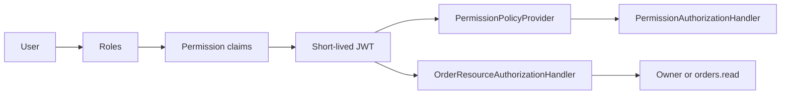

# Authorization

Identity remains ASP.NET Core Identity. Native user-role memberships and role permission claims form a deterministic union of effective permissions. Direct user overrides and deny rules are intentionally absent. Permission names correspond to implemented capabilities and are centralized in C# `Permissions` and TypeScript `auth/permissions.ts`.

## Default bundles

Existing `Admin` and `Customer` names are preserved for compatibility. Development initialization adds default role claims once, using a seeding marker; subsequent restarts do not overwrite edited staff bundles.

| Bundle | Capabilities |
| --- | --- |
| Admin | All catalog, inventory, order, payment, shipment, access and system permissions |
| Customer | Product read; owner APIs derive access from the authenticated subject |
| CatalogManager | Backoffice access and product read/create/update/deactivate |
| WarehouseManager | Backoffice, product read, inventory read/adjust/reservations and cross-customer order read |
| OrderManager | Backoffice, orders, payments, shipments read/update |
| SupportAgent | Backoffice, orders/payments/shipments/users read |

Roles are labels and bundles. Feature authorization checks permissions. React never maintains these mappings. Protected Admin and Customer bundles cannot be edited through the management API. A manager cannot change their own memberships or a role they hold. Only `users.roles.manage` permits access mutations. These rules protect the active administrator from accidental lockout and direct self escalation.

## Endpoint matrix

| Gateway route | Authorization |
| --- | --- |
| `POST /api/auth/register`, `/login`, `/refresh`, `/logout` | Public credentials or refresh-token possession |
| `GET /api/auth/me` | Authenticated subject |
| `GET /api/auth/users`, `/users/{id}` | `users.read` |
| `PUT /api/auth/users/{id}/roles` | `users.roles.manage`, target cannot be actor |
| `GET /api/auth/roles`, `/permissions`, `/access/audit`; `PUT /roles/{id}/permissions` | `users.roles.manage`; system/actor bundle edits forbidden |
| `GET /api/catalog/products`, `/products/{id}` | Public browsing |
| `POST /api/catalog/products` | `catalog.products.create` |
| `PUT /api/catalog/products/{id}`, `POST /{id}/activate` | `catalog.products.update` |
| `POST /api/catalog/products/{id}/deactivate` | `catalog.products.deactivate` |
| Cart operations | Authenticated subject only; no client-supplied owner ID |
| `POST /api/orders/checkout`, `GET /api/orders` | Authenticated subject only |
| `GET /api/orders/{id}` | Owner OR `orders.read`; unrelated users get 404 |
| `GET /api/orders/admin`, `/admin/{id}`, `/summary` | `orders.read` |
| `GET /api/inventory`, `/summary`, `/{id}` | `inventory.read` |
| `GET /api/inventory/{id}/availability` | Public available units only |
| `GET /api/inventory/{id}/reservations` | `inventory.reservations.read` |
| `POST /api/inventory/{id}/receipts`, `/{id}/adjustments` | `inventory.adjust` |
| All payment reads | `payments.read` |
| All shipping reads | `shipments.read` |
| `POST /api/shipping/{id}/advance` | `shipments.read` AND `shipments.update` |
| `GET /health/ready` | Public infrastructure readiness; backoffice page additionally checks `system.health.read` |

Cart and profile always select the JWT subject. Ordering loads an order and invokes `IAuthorizationService` with its authoritative owner. Customers obtain the shipment reference from their own Ordering snapshot instead of reading another service's administrative records. No service accesses Identity's database; each validates signed JWT claims locally.

## Claims, renewal and audit

JWT contains `sub`, `email`, role claims and permission claims, plus normal expiry/issuer/audience metadata. Access lifetime is 15 minutes, with 30 seconds of validation clock tolerance, and refresh lifetime seven days. Login and refresh resolve roles and permissions from the current Identity store. Refresh atomically claims the opaque token and commits its replacement in one local transaction: concurrent renewal has one winner and replay is rejected. User membership changes revoke that user's refresh tokens and require a fresh sign-in. Bundle changes appear at the next refresh. Already-issued access tokens may retain earlier permissions until expiry. There is no distributed revocation cache.

Access changes commit with actor ID, target ID, action, serialized before/after values and UTC time in Identity's database. Administrative audit exposes the latest 100 entries. Tokens and secrets are not recorded. The Identity `AddAccessChangeAudit` migration is required; role permissions use existing Identity role-claim tables. Inventory adjustments similarly record actor, reason, quantity delta and timestamp in the same local transaction as the stock mutation.

Tests cover unauthenticated 401, missing-permission 403, successful permission checks, unrelated-owner 404, privileged order read, bundle resolution through login, changed permissions on refresh, replay rejection, and prevented self escalation. Frontend checks are for usability; direct API calls remain subject to ASP.NET Core policies.
