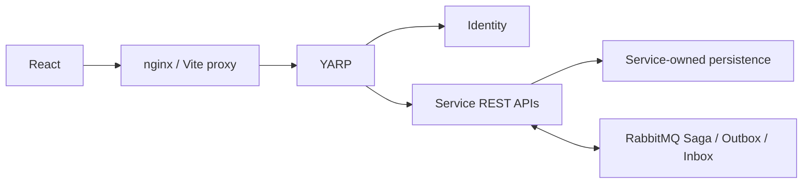

# Storefront and backoffice

`../Commerce.Web` is the sibling checkout of the public [commerce-web repository](https://github.com/vixtruong/commerce-web), containing one React application with two layouts. The storefront uses spacious product and checkout pages; the backoffice uses dense tables, a permission-aware sidebar and command palette. Shared controls provide consistent focus, dialogs, statuses, forms and error feedback. CSS tokens define the restrained green/cream palette, typography, spacing and responsive layout. Local SVG illustrations describe only seeded sample SKUs; other products display an explicit image-unavailable state.

## Runtime and state

React 19, strict TypeScript, Vite, React Router, TanStack Query/Table, React Hook Form, Zod, Tailwind CSS, Radix Dialog, Lucide and Recharts are used. Zustand stores sidebar and palette state only. Server records, authentication profile, cart and summaries live in TanStack Query. Search, filters, sorting and pagination live in the URL. Form state stays in React Hook Form.

Features contain their API types, query options, pages and validation. `api/client.ts` owns fetch, error normalization and token renewal. `auth` owns the current-user query, permission catalog and guards. `components` contains reusable controls; `lib` contains formatting, status labels and a typed English copy catalog for shared authentication, checkout, validation and errors. A translated catalog can preserve those keys without changing business rules; English is the delivered language. Currency/date formatting uses Intl. Administrative routes are lazy-loaded and the charts bundle is separate from the storefront. A section error boundary contains chart rendering failures while preserving the surrounding dashboard.

Both nginx and Vite proxy `/api` and Gateway readiness only to YARP. React has no service-port URLs, gRPC client or RabbitMQ connection. There is no cross-service database query.

## Authentication

The access token stays in module memory. An opaque refresh token is stored in `sessionStorage`, scoped to the current browser tab. Reloading renews the access token. Concurrent 401 responses share one refresh request; a late 401 reuses the already-renewed token. Each request retries authentication at most once. Logout cancels and clears private queries and increments a session generation so an earlier response cannot restore an old session. A failed refresh with 401 expires the session; a transient outage keeps the refresh credential available for explicit retry. Mutations never retry automatically.

This existing bearer-token API makes a tab-scoped refresh token a practical local integration. It remains readable by JavaScript. A production BFF with secure HttpOnly cookies, CSRF controls and server-side refresh storage would reduce that exposure. The Docker frontend serves a content security policy and does not render untrusted HTML.

`GET /api/auth/me` returns roles and effective permissions. React uses permission helpers, `Can` and `RequirePermission`; backend policies are authoritative. Authenticated users without access see a 403 page. Login preserves a safe same-origin return path. See [authorization.md](authorization.md) for bundle management, resource rules and token staleness.

## Checkout consistency

Checkout saves the authenticated owner's idempotency key and immutable address payload in tab storage **before** submitting. Double submission is blocked. A network failure or component remount reuses the same attempt, rather than creating another order. Session expiry retains the owner-scoped attempt for a fresh sign-in; explicit logout removes it. A different account cannot reuse the saved attempt. Once accepted, the saved order ID resumes its processing page.

The API returns 202 after committing Ordering state, Saga and Outbox. React polls the owner's order every two seconds while the Saga is active. Confirmation waits for the persisted shipment-created state. Cancellation keeps polling during compensation and only says stock was released once compensation ends. Polling stops at a terminal state, error, unmount or two-minute limit; a manual resume control handles delays. Unknown statuses have a safe label. The timeline shows persisted facts without inventing transition timestamps.

Cart edits are optimistic, serialized per cart and rolled back on failure. Totals use integer cents and currency grouping; checkout validates the authoritative server snapshot. Clearing the cart after completion is an explicit action because cart contents may have changed while the Saga ran. The backoffice product table reads Inventory availability for at most its 20 visible rows and reuses Query's short-lived cache; Catalog does not acquire an Inventory database dependency.

## Routes and capabilities

| Storefront routes | Purpose |
| --- | --- |
| `/`, `/products`, `/products/:productId` | Home, bounded catalog search/filter/sort, details and live availability |
| `/login`, `/register` | Authentication and validated registration |
| `/cart`, `/checkout` | Server cart and address checkout |
| `/checkout/processing/:orderId`, `/checkout/success/:orderId` | Saga progress, cancellation and confirmation |
| `/orders`, `/orders/:orderId` | Owner history and persisted order/address/shipment snapshots |
| `/account`, `/account/profile` | Read-only profile, access display and logout |

| Backoffice routes | Required permission |
| --- | --- |
| `/admin` | `backoffice.access`; each dashboard panel checks its own read permission |
| `/admin/products`, `/admin/products/:productId` | `catalog.products.read` / `catalog.products.update` |
| `/admin/products/new` | `catalog.products.create` |
| `/admin/inventory`, `/admin/inventory/:productId` | `inventory.read`; adjustments need `inventory.adjust` |
| `/admin/orders`, `/admin/orders/:orderId` | `orders.read` |
| `/admin/payments`, `/admin/payments/:paymentId` | `payments.read` |
| `/admin/shipments`, `/admin/shipments/:shipmentId` | `shipments.read`; advancement needs `shipments.update` |
| `/admin/access/users`, `/admin/access/users/:userId` | `users.read`; role edits need `users.roles.manage` |
| `/admin/access/roles`, `/admin/access/roles/:roleId`, `/admin/access/audit` | `users.roles.manage` |
| `/admin/system` | `system.health.read` |

## Testing and deliberate boundaries

Vitest/Testing Library/MSW test refresh races, permission guards/navigation, form validation, cart controls, money and checkout attempts. Playwright uses the real Gateway and Compose services for customer checkout, admin editing, stock, permission refresh/replay, ownership, access denial and responsive screenshots. Storybook documents shared controls, product cards and table states. CI checks .NET, frontend lint/types/tests/build, Storybook and real browser flows including failed payment.

No unsupported refund, administrative cancellation, image upload, password change, editable profile, carrier tracking, category assignment or direct user permission control is presented. Categories exist without product assignment; availability is fetched on details rather than fabricated as a catalog filter. Payment is the existing deterministic development provider and no card details are collected. Dashboard order value is grouped by currency and is not described as settled accounting revenue.
